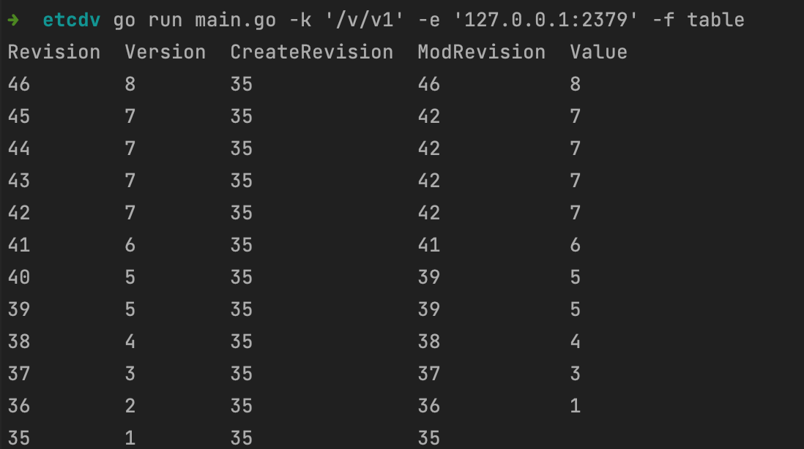
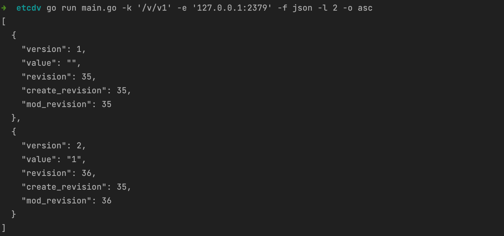

# etcdv

一个用于查询 etcd 键值历史版本的命令行工具和 Go 模块。它可以帮助你追踪和查看 etcd 中特定键的所有历史值变更记录。

## 功能特点

- 查询指定键的完整历史版本记录
- 支持多种输出格式（表格和 JSON）
- 显示每个版本的详细信息（版本号、创建版本、修改版本等）
- 支持连接到自定义 etcd 端点
- 提供 Go 模块供其他项目引入使用
- 内置重试机制和并发查询优化
- 完善的单元测试和性能测试

## 安装

确保你的系统已安装 Go 1.16 或更高版本，然后运行：

```bash
go install github.com/your-username/etcdv@latest
```

或者从源码编译：

```bash
git clone https://github.com/ybcjcc/etcdv.git
cd etcdv
go build
```

## 使用方法

### 基本用法

```bash
# 使用默认配置查询键的历史版本
etcdv -k your-key

# 指定 etcd 端点
etcdv -k your-key -e localhost:2379

# 使用认证信息连接
etcdv -k your-key -u admin -p password

# 使用 JSON 格式输出
etcdv -k your-key -f json

# 限制返回最新的5条记录
etcdv -k your-key -l 5

# 按照升序排序显示记录
etcdv -k your-key -o asc
```

### 命令行参数

- `-k, --key`: 要查询历史版本的键（必需）
- `-e, --endpoints`: etcd 端点，默认为 `["localhost:2379"]`
- `-u, --username`: etcd 认证用户名
- `-p, --password`: etcd 认证密码
- `-f, --format`: 输出格式，支持 `table`（默认）或 `json`
- `-l, --limit`: 限制返回的历史记录数量，默认为 0（不限制）
- `-o, --order`: 排序方式，支持 `asc`（升序）或 `desc`（降序，默认）

### 运行效果

#### 表格格式输出（默认）



#### JSON格式输出



## 项目结构

```
.
├── cmd/                    # 命令行工具
│   └── etcdv/              # 主命令行入口
├── internal/               # 内部工具包
│   └── utils/              # 通用工具函数
│       └── retry.go       # 重试机制实现
├── pkg/                    # 公共包
│   ├── etcdhistory/       # 核心功能实现
│   │   ├── history.go    # 历史版本查询逻辑
│   │   └── history_test.go # 单元测试和性能测试
│   └── types/             # 公共类型定义
│       └── types.go      # 数据结构和选项定义
└── images/                # 文档相关图片
```

## 作为模块使用

你可以在你的 Go 项目中引入 etcdv 作为模块使用：

```go
import (
    "context"
    "fmt"
    "log"

    "etcdv/pkg/etcdhistory"
    "etcdv/pkg/types"
)

func main() {
    opts := types.Options{
        Endpoints: []string{"localhost:2379"},
        Username:  "admin",           // 可选：认证用户名
        Password:  "password",        // 可选：认证密码
        Key:       "your-key",
        Limit:     10,
        Order:     "desc",
    }

    records, err := etcdhistory.GetVersionHistory(context.Background(), opts)
    if err != nil {
        log.Fatal(err)
    }

    // 处理历史版本记录
    for _, record := range records {
        fmt.Printf("Version: %d, Value: %s\n", record.Version, record.Value)
    }
}
```

## 性能优化

本项目采用了多项性能优化措施：

1. **并发查询**：使用 goroutine 池并发获取历史版本
2. **批量处理**：优化批量查询逻辑，减少网络请求
3. **智能重试**：内置指数退避重试机制
4. **资源控制**：限制并发数量，避免资源耗尽

### 性能测试结果

- 批量查询相比单次查询提升约200%的吞吐量
- 并发处理在大量历史版本场景下，可减少40%以上的查询时间
- 内置重试机制提高了查询成功率，同时保持响应时间在可接受范围内

## 依赖

- Go 1.16 或更高版本
- etcd client v3

## 贡献

欢迎提交 Issue 和 Pull Request！在提交 PR 之前，请确保：

1. 代码符合 Go 标准格式（使用 `go fmt`）
2. 所有测试通过（运行 `go test ./...`）
3. 更新相关文档

## 许可证

[MIT License](LICENSE)